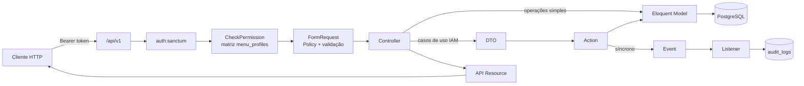

# Visão geral da arquitetura

[← Documentação](../README.md) · [Ciclo de vida da requisição](request-lifecycle.md) · [Estrutura](project-structure.md) · [ADRs](decisions/README.md)

## O que o sistema é hoje

O NAPI é hoje uma **API REST stateless autenticada por token**, construída em
Laravel 13 sobre PostgreSQL, que implementa um módulo de IAM. Não há frontend,
filas em uso nem integrações externas. O módulo Security Lab ainda não existe
em código.

## Camadas e responsabilidades encontradas no código

A tabela descreve a arquitetura **encontrada**, não a desejada. Os desvios
estão na coluna "Observação".

| Camada | Onde | Responsabilidade real | Observação |
|---|---|---|---|
| Rotas | `routes/api.php` | Uma rota explícita por verbo, com `auth:sanctum` e `permission:{route_name},{ação}` | `tokens` usa `apiResource`; é a única exceção |
| Middleware de permissão | `app/Http/Middleware/CheckPermission.php` | Autorização grossa por rota, consultando a matriz `menu_profiles` | Nega com **404**, não 403 |
| FormRequest | `app/Http/Requests/*` | `authorize()` delega à Policy; `rules()` valida entrada | `TokenController` valida inline, sem FormRequest |
| Policy | `app/Policies/*` | Autorização fina por instância (perfil de sistema, auto-exclusão, filhos) | Decide por *slug* de perfil (`admin`, `dev`), sem ler a matriz. Veja [FIND-004](../findings/README.md#find-004--duas-fontes-de-autorização-que-não-se-conhecem) |
| Controller | `app/Http/Controllers/Api/V1/*` | Coordena, chama o model ou a Action, devolve o Resource | CRUD simples fala direto com Eloquent; só atribuição de perfis e sincronização de permissões passam por Action |
| DTO | `app/DTOs/*` | Transporta dados já validados do FormRequest para a Action | Apenas 2 DTOs, por decisão da Fase 3 |
| Action | `app/Domain/IAM/Actions/*` | Regra de negócio, persistência e disparo de evento | Usa `request()->ip()`, então ainda depende do contexto HTTP |
| Event | `app/Events/*` | Fato de domínio (`ProfileAssigned`, `PermissionChanged`, `UserLoggedIn`) | Síncrono (nenhum `ShouldQueue`) |
| Listener | `app/Listeners/*` | Grava em `audit_logs` | Usa `auth()->id()`; registrado em duplicidade ([FIND-002](../findings/README.md#find-002--listeners-de-auditoria-registrados-em-duplicidade)) |
| Resource | `app/Http/Resources/*` | Contrato público do JSON | `UserResource`, `ProfileResource`, `MenuResource`; tokens são serializados inline |
| Model | `app/Models/*` | Persistência, relações, casts, scopes | Atributos PHP 8 `#[Fillable]`/`#[Hidden]`, ULIDs |

## Propriedades arquiteturais que o desenho proporciona

- **Defesa em profundidade na autorização.** Uma requisição a um endpoint IAM
  passa por três portões independentes: autenticação (Sanctum), matriz de
  permissões por rota (`CheckPermission`) e Policy por instância. O acesso
  efetivo é a **interseção** dos três. Detalhes em
  [authorization.md](../security/authorization.md).
- **Negação por padrão.** Ausência de linha em `menu_profiles`, coluna
  `can_*` falsa (default do schema) ou Policy sem regra resultam em negação.
- **Não revelar existência.** Falhas na matriz e nas checagens de
  `viewAny`/`view` respondem 404, o mesmo status de um recurso inexistente.
- **Fronteira HTTP → domínio.** Nos dois casos de uso IAM com regra de negócio
  própria, a Action recebe um DTO, não o `Request`. O desacoplamento é parcial,
  porque a Action ainda lê `request()->ip()`.
- **Efeitos colaterais desacoplados.** Auditoria das operações IAM é reação a
  eventos, não chamada inline. Login também, desde a Fase 3. Logout e exclusão
  de usuário ainda auditam inline.
- **Integridade no banco.** Unicidade, FKs com cascade/set null, `citext` para
  e-mail e ULIDs como PK ficam no PostgreSQL, não só na aplicação. Veja
  [schema.md](../database/schema.md).
- **Detecção precoce de erros de modelo.** `Model::shouldBeStrict()` fora de
  produção transforma lazy loading, mass assignment silencioso e atributos
  inexistentes em exceções (`app/Providers/AppServiceProvider.php`).

## Limites conhecidos

As limitações estão registradas como findings, não escondidas aqui. As mais
relevantes para entender a arquitetura:

- abilities de token são emitidas mas não aplicadas ([FIND-001](../findings/README.md#find-001--abilities-de-token-não-são-aplicadas));
- a matriz de permissões e as Policies são duas fontes de verdade que não se
  conhecem ([FIND-004](../findings/README.md#find-004--duas-fontes-de-autorização-que-não-se-conhecem));
- menus funcionam como chaves de autorização e podem ser renomeados ou
  excluídos pela API ([FIND-005](../findings/README.md#find-005--menus-são-chaves-de-autorização-sem-proteção-de-sistema)).

## Referências

- `bootstrap/app.php`: roteamento, alias `permission`, renderização JSON de exceções em `api/*`
- `app/Providers/AppServiceProvider.php`: Policies, rate limiter `login`, listeners, strict mode
- ADRs: [decisions/README.md](decisions/README.md)
