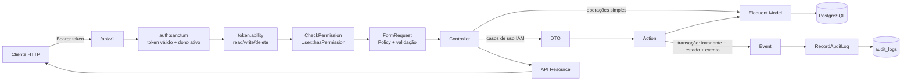

# Visão geral da arquitetura

[← Documentação](../README.md) · [Ciclo de vida da requisição](request-lifecycle.md) · [Estrutura](project-structure.md) · [ADRs](decisions/README.md)

## O que o sistema é hoje

O NAPI é hoje uma **API REST stateless autenticada por token**, construída em
Laravel 13 sobre PostgreSQL, que implementa um módulo de IAM. Não há frontend,
filas em uso nem integrações externas. O módulo Security Lab ainda não existe
em código.

## Camadas e responsabilidades encontradas no código

A tabela descreve a arquitetura **encontrada** no código, atualizada na Fase
3.2. Os desvios estão na coluna "Observação".

| Camada | Onde | Responsabilidade real | Observação |
|---|---|---|---|
| Rotas | `routes/api.php` | Uma rota explícita por verbo; grupo `auth:sanctum` + `token.ability`; `permission:{key}.{ação}` por rota | `tokens` usa `apiResource`; é a única exceção |
| Middleware de ability | `app/Http/Middleware/EnsureTokenAbility.php` | Exige a ability do token correspondente ao método HTTP | 403 |
| Middleware de permissão | `app/Http/Middleware/CheckPermission.php` | Permissão funcional por rota, delegando a `User::hasPermission()` | Nega com **404**, não 403 |
| FormRequest | `app/Http/Requests/*` | `authorize()` delega à Policy (com o conjunto pedido, quando relevante); `rules()` valida entrada | `TokenStoreRequest::authorize` limita as abilities às do token atual |
| Policy | `app/Policies/*` | Permissão funcional via `hasPermission()` + regras de instância e anti-escalação | Desde a Fase 3.2 não decide por slug ([ADR-0008](decisions/ADR-0008-layered-authorization-model.md)) |
| Controller | `app/Http/Controllers/Api/V1/*` | Coordena, chama o model ou a Action, dispara eventos de auditoria, devolve o Resource | CRUD simples fala direto com Eloquent (em transação com o evento); atribuição de perfis, sincronização de permissões e exclusão de usuário passam por Action |
| DTO | `app/DTOs/*` | Transporta dados já validados do FormRequest para a Action | Apenas 2 DTOs, por decisão da Fase 3 |
| Action | `app/Domain/IAM/Actions/*` | Regra de negócio, persistência e disparo de evento, em transação | Recebe um `AuditContext` explícito; não depende de HTTP |
| Invariante | `app/Domain/IAM/EnsureActiveAdministratorRemains.php` | "≥ 1 administrador ativo", com lock no perfil admin | Lança `LastActiveAdministratorException` (409) |
| Event | `app/Events/*` | Fato de domínio; os auditáveis implementam `Contracts\Auditable` e carregam `AuditContext` | Síncrono (nenhum `ShouldQueue`) |
| Listener | `app/Listeners/RecordAuditLog.php` | Grava uma linha em `audit_logs` por evento `Auditable` | Registrado só pela discovery |
| Resource | `app/Http/Resources/*` | Contrato público do JSON | `UserResource`, `ProfileResource`, `MenuResource`; tokens são serializados inline |
| Model | `app/Models/*` | Persistência, relações, casts, scopes | Atributos PHP 8 `#[Fillable]`/`#[Hidden]`, ULIDs |

## Propriedades arquiteturais que o desenho proporciona

- **Autorização em camadas com fonte funcional única.** Uma requisição a um
  endpoint IAM passa por autenticação (token válido e dono ativo), ability do
  token, permissão funcional (`User::hasPermission()` sobre a matriz), Policy
  (regras de instância) e invariante de domínio. Cada camada responde uma
  pergunta e só restringe ([ADR-0008](decisions/ADR-0008-layered-authorization-model.md),
  [authorization.md](../security/authorization.md)).
- **Negação por padrão.** Ausência de linha em `menu_profiles`, coluna
  `can_*` falsa (default do schema) ou Policy sem regra resultam em negação.
- **Não revelar existência.** Falhas na matriz e nas checagens de
  `viewAny`/`view` respondem 404, o mesmo status de um recurso inexistente.
- **Fronteira HTTP → domínio.** Os casos de uso com regra de negócio recebem
  DTO e `AuditContext`, nunca o `Request`.
- **Efeitos colaterais desacoplados e atômicos.** Toda auditoria é reação a
  eventos, disparados dentro da transação da operação; estado e trilha fazem
  commit ou rollback juntos.
- **Integridade no banco.** Unicidade, FKs com cascade/set null, `citext` para
  e-mail e ULIDs como PK ficam no PostgreSQL, não só na aplicação. Veja
  [schema.md](../database/schema.md).
- **Detecção precoce de erros de modelo.** `Model::shouldBeStrict()` fora de
  produção transforma lazy loading, mass assignment silencioso e atributos
  inexistentes em exceções (`app/Providers/AppServiceProvider.php`).

## Limites conhecidos

As limitações estão registradas como findings, não escondidas aqui. As mais
relevantes para entender a arquitetura:

- a permissão funcional é declarada por rota; uma rota nova sem `permission:`
  e sem Policy ficaria acessível a qualquer autenticado (não há teste que
  varra as rotas);
- as respostas ainda não seguem um contrato único (envelope, negação manual
  em `index`/`show`) ([FIND-020](../findings/README.md#find-020--respostas-de-autorização-e-de-tokens-inconsistentes));
- o rate limit cobre só o login ([FIND-016](../findings/README.md#find-016--rate-limiting-restrito-ao-login-e-por-emailip)).

Os limites estruturais registrados na Fase 3.1 (abilities inertes, duas fontes
de autorização, menus como chaves mutáveis) foram resolvidos na Fase 3.2.

## Referências

- `bootstrap/app.php`: roteamento, aliases `permission` e `token.ability`, renderização JSON de exceções em `api/*`
- `app/Providers/AppServiceProvider.php`: Policies, callback de autenticação (usuário ativo), rate limiter `login`, strict mode
- ADRs: [decisions/README.md](decisions/README.md)
