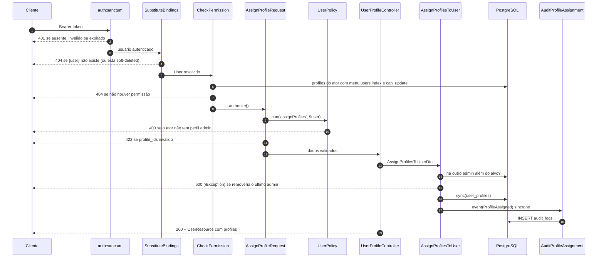

# Ciclo de vida da requisição

[← Visão geral](overview.md) · [Autorização](../security/authorization.md) · [API v1](../api/v1.md)

Este documento segue uma requisição real pelo sistema. A ordem dos middlewares
foi confirmada com `Router::gatherRouteMiddleware()` para `users.show`:

```text
Authenticate:sanctum → SubstituteBindings → CheckPermission:users.index,view
```

O grupo `api` do Laravel 13 contém apenas `SubstituteBindings`. Não há
throttle global nem `EnsureFrontendRequestsAreStateful` (o
`bootstrap/app.php` não chama `statefulApi()`).

## Fluxo completo: `PUT /api/v1/users/{user}/profiles`

É o fluxo mais longo do sistema e o único, junto com a sincronização de
permissões, que percorre todas as camadas.



## Etapas e o que cada uma garante

| # | Etapa | Arquivo | Garante | Resposta em falha |
|---|---|---|---|---|
| 1 | Autenticação | `Authenticate:sanctum` | Token existe, não expirou (7 dias globais ou `expires_at`), dono existe e não está soft-deleted | 401 |
| 2 | Route model binding | `SubstituteBindings` | O ULID existe; `User` aplica o escopo de soft delete | 404 |
| 3 | Matriz de permissões | `app/Http/Middleware/CheckPermission.php` | Algum perfil do ator tem `can_{ação}` no menu cujo `route_name` foi passado ao middleware | 404 |
| 4 | Autorização fina | `FormRequest::authorize()` → Policy | Regras por instância (admin, perfil de sistema, auto-exclusão) | 403 |
| 5 | Validação | `FormRequest::rules()` | Formato e unicidade; só campos declarados chegam a `validated()` | 422 |
| 6 | Caso de uso | Controller → DTO → Action | Regra de negócio (último admin) | 500 hoje ([FIND-006](../findings/README.md#find-006--regra-do-último-administrador-tem-janela-de-corrida-e-resposta-500)) |
| 7 | Persistência | Eloquent → PostgreSQL | Constraints de FK/unique no banco | 500 (`QueryException`) |
| 8 | Evento e auditoria | Event → Listener | Linha em `audit_logs` | Sem transação: estado já alterado |
| 9 | Resposta | API Resource | Contrato JSON; `password` oculto por `#[Hidden]` | — |

### Onde a autorização acontece em cada tipo de endpoint

A etapa 4 não é uniforme. Ela muda de lugar conforme a ação:

| Ação | Onde a Policy é chamada | Status em negação |
|---|---|---|
| `index`, `show` (users, profiles, menus) | Manualmente no controller com `$request->user()->can()` | 404 (JSON `{"message":"Not found."}`) |
| `store`, `update`, `syncMenus`, atribuição de perfis | `FormRequest::authorize()` | 403 |
| `destroy` | `$this->authorize()` no controller | 403 |
| `menus.tree` | Nenhuma Policy; só a matriz | — |
| `tokens.*`, `auth.me`, `auth.logout` | Nenhuma Policy nem matriz; escopo pelo próprio usuário | — |

Na prática, como a matriz (etapa 3) roda antes e já responde 404 a quem não
tem permissão na rota, os 403 só são vistos por quem passou pela matriz mas
esbarrou numa regra de instância. É o caso de um admin tentando excluir um
perfil de sistema.

## Fluxos mais curtos

**CRUD simples** (`POST /profiles`, `PUT /menus/{menu}` etc.): etapas 1 a 5,
depois o controller chama `Model::create($request->validated())` ou
`$model->update(...)` diretamente. Não há DTO, Action nem evento, e portanto
**não há auditoria** ([FIND-012](../findings/README.md#find-012--lacunas-de-cobertura-da-auditoria)).

**Login** (`POST /auth/login`): sem `auth:sanctum`; passa pelo rate limiter
nomeado `login`, pelo `LoginRequest` e pelo `AuthController`, que dispara
`UserLoggedIn` e emite um token Sanctum. Veja
[authentication.md](../security/authentication.md).

## Ordem de rotas

`GET /menus/tree` é registrada **antes** de `GET /menus/{menu}` em
`routes/api.php`. Se a ordem fosse invertida, `tree` seria capturado como
`{menu}`, o binding por ULID falharia e a rota responderia 404. O
`route:list` confirma a ordem atual, mas nenhum teste protege essa ordenação
explicitamente. O teste `returns menu tree for logged user` falharia se ela
quebrasse, então há proteção indireta.

## Tratamento de exceções

`bootstrap/app.php` força respostas JSON para `api/*` e para requisições que
esperam JSON. Não há mapeamento customizado de exceções: `AuthorizationException`
vira 403, `ModelNotFoundException` vira 404, `ValidationException` vira 422 e
qualquer outra `\Exception`, incluindo a regra de negócio do último admin,
vira 500. Com `APP_DEBUG=true` o 500 inclui mensagem e stack trace.
