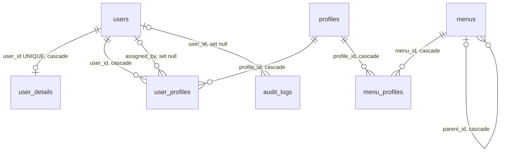

# Schema

[← Banco de dados](README.md) · [IAM](../modules/iam.md) · [ADR-0002](../architecture/decisions/ADR-0002-postgresql.md)

Fonte: `database/migrations/*`. Só estão listadas as tabelas do domínio. As
tabelas padrão do framework (`cache`, `jobs`, `sessions`,
`password_reset_tokens`) existem, mas não são usadas pela API hoje.

## Diagrama

## Tabelas

### `users`

| Coluna | Tipo | Constraint |
|---|---|---|
| `id` | ULID | PK |
| `name` | varchar | |
| `email` | **citext** | UNIQUE (sem distinção de maiúsculas) |
| `email_verified_at` | timestamp | nullable |
| `password` | varchar | hash bcrypt (cast `hashed`) |
| `is_active` | boolean | default `true` |
| `created_at`, `updated_at`, `deleted_at` | timestamp | soft delete |

A migration cria a coluna como `string` e depois executa
`ALTER COLUMN email TYPE citext`, porque o Schema Builder não tem o tipo.

### `user_details`

Um por usuário (`user_id` UNIQUE, FK cascade). Dados pessoais e LGPD:
`cpf_hash` (UNIQUE, nullable), telefone, endereço brasileiro (`cep`, `state`
com 2 caracteres, `country` default `BR`), `data_consent_at`,
`data_export_requested_at`, `data_deletion_requested_at`. Não é exposto pela
API. Veja [FIND-008](../findings/README.md#find-008--hash-de-cpf-é-reversível-por-força-bruta).

### `profiles`

`id` ULID PK · `name` varchar(100) UNIQUE · `slug` varchar(100) UNIQUE ·
`description` text · `is_system` boolean default `false` · timestamps.

### `user_profiles` (pivot → `UserProfile`)

| Coluna | Tipo | Constraint |
|---|---|---|
| `user_id` | ULID | PK composta; FK `users` cascade |
| `profile_id` | ULID | PK composta; FK `profiles` cascade |
| `assigned_by` | ULID | nullable; FK `users` **set null** |
| `assigned_at` | timestamp | default `CURRENT_TIMESTAMP`; indexado |

A PK composta impede atribuir o mesmo perfil duas vezes.

### `menus`

| Coluna | Tipo | Constraint |
|---|---|---|
| `id` | ULID | PK |
| `parent_id` | ULID | nullable; FK auto-referente `menus` cascade; indexado |
| `label` | varchar(100) | |
| `route_name` | varchar(100) | UNIQUE; **chave de autorização** |
| `icon` | varchar(50) | nullable |
| `order` | integer | default 0; indexado |
| `is_active` | boolean | default `true` |
| `description` | text | nullable |

A FK de `parent_id` é criada em um segundo `Schema::table`. O comentário na
migration explica que, no PostgreSQL, a PK do ULID é adicionada por um
`ALTER TABLE` separado que poderia rodar depois de uma FK inline.

### `menu_profiles` (pivot → `MenuProfile`): a matriz de permissões

| Coluna | Tipo | Constraint |
|---|---|---|
| `menu_id` | ULID | PK composta; FK cascade |
| `profile_id` | ULID | PK composta; FK cascade |
| `can_view`, `can_create`, `can_update`, `can_delete` | boolean | **default `false`** (deny by default) |

Sem timestamps: não há histórico de quando uma permissão mudou fora de
`audit_logs`.

### `audit_logs`

`id` ULID PK · `user_id` ULID FK **set null** · `action` varchar(50) ·
`subject_type` varchar(100) · `subject_id` ULID · `ip` **inet** · `user_agent`
text · `meta` **jsonb** · `created_at` default `CURRENT_TIMESTAMP`. Índices
`(user_id, created_at)` e `(subject_type, subject_id)`. Sem `updated_at`.
Veja [audit.md](../security/audit.md).

### `personal_access_tokens` (Sanctum)

`id` **bigint** PK · `tokenable_type` + `tokenable_id` (`ulidMorphs`,
indexados) · `name` text · `token` varchar(64) UNIQUE (hash SHA-256) ·
`abilities` text · `last_used_at` · `expires_at` (indexado) · timestamps.

## Onde o PostgreSQL participa da arquitetura

| Recurso | Uso | Efeito |
|---|---|---|
| `citext` | `users.email` | Unicidade case-insensitive no banco (teste `email is case-insensitive (citext)`) |
| ULID (`char(26)`) | PKs de domínio | IDs não sequenciais e ordenáveis por tempo |
| `jsonb` | `audit_logs.meta` | Metadado variável por ação, consultável |
| `inet` | `audit_logs.ip` | IP validado pelo tipo |
| PKs compostas | pivots | Impedem vínculos duplicados |
| `cascade` | pivots, `user_details`, `menus.parent_id` | Excluir perfil ou menu remove vínculos e permissões (testes de force delete) |
| `set null` | `audit_logs.user_id`, `user_profiles.assigned_by` | Trilha e histórico sobrevivem à exclusão do ator (teste) |
| `UNIQUE` | `email`, `profiles.name/slug`, `menus.route_name`, `cpf_hash`, `token` | Última linha de defesa contra duplicidade (testes de validação) |
| Defaults booleanos | `menu_profiles.can_*` | Negação por padrão garantida no schema |

Não há uso de `restrict`: a proteção contra excluir perfis com usuários e
menus com filhos é feita na **Policy**, não no banco. Como a exclusão é
física (perfis e menus não têm soft delete), se a Policy falhar o `cascade`
apaga os vínculos.
