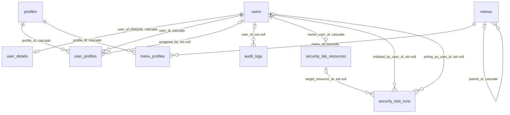

# Schema

[← Banco de dados](README.md) · [IAM](../modules/iam.md) · [ADR-0002](../architecture/decisions/ADR-0002-postgresql.md)

Fonte: `database/migrations/*`. Só estão listadas as tabelas do domínio. As
tabelas padrão do framework (`cache`, `jobs`, `sessions`,
`password_reset_tokens`) existem, mas não são usadas pela API hoje.

## Diagrama

## Tabelas

### `users`

| Coluna | Tipo | Constraint |
|---|---|---|
| `id` | ULID | PK |
| `name` | varchar | |
| `email` | **citext** | UNIQUE (sem distinção de maiúsculas) |
| `email_verified_at` | timestamp | nullable |
| `password` | varchar | hash bcrypt (cast `hashed`) |
| `is_active` | boolean | default `true` |
| `created_at`, `updated_at`, `deleted_at` | timestamp | soft delete |

A migration cria a coluna como `string` e depois executa
`ALTER COLUMN email TYPE citext`, porque o Schema Builder não tem o tipo.

### `user_details`

Um por usuário (`user_id` UNIQUE, FK cascade). Dados pessoais e LGPD:
`cpf_hash` (UNIQUE, nullable), telefone, endereço brasileiro (`cep`, `state`
com 2 caracteres, `country` default `BR`), `data_consent_at`,
`data_export_requested_at`, `data_deletion_requested_at`. Não é exposto pela
API. Veja [FIND-008](../findings/README.md#find-008--hash-de-cpf-é-reversível-por-força-bruta).

### `profiles`

`id` ULID PK · `name` varchar(100) UNIQUE · `slug` varchar(100) UNIQUE ·
`description` text · `is_system` boolean default `false` · timestamps.

### `user_profiles` (pivot → `UserProfile`)

| Coluna | Tipo | Constraint |
|---|---|---|
| `user_id` | ULID | PK composta; FK `users` cascade |
| `profile_id` | ULID | PK composta; FK `profiles` cascade |
| `assigned_by` | ULID | nullable; FK `users` **set null** |
| `assigned_at` | timestamp | default `CURRENT_TIMESTAMP`; indexado |

A PK composta impede atribuir o mesmo perfil duas vezes.

### `menus`

| Coluna | Tipo | Constraint |
|---|---|---|
| `id` | ULID | PK |
| `parent_id` | ULID | nullable; FK auto-referente `menus` cascade; indexado |
| `key` | varchar(100) | NOT NULL, UNIQUE; **identificador de permissão** (`{key}.{ação}`), imutável pela API (Fase 3.2) |
| `label` | varchar(100) | |
| `route_name` | varchar(100) | UNIQUE; só navegação desde a Fase 3.2 |
| `icon` | varchar(50) | nullable |
| `order` | integer | default 0; indexado |
| `is_active` | boolean | default `true`; só navegação, não afeta autorização |
| `is_system` | boolean | default `false`; menus-chave não excluíveis pela API (Fase 3.2) |
| `description` | text | nullable |

`key` e `is_system` foram adicionadas na Fase 3.2 diretamente na migration
de criação (`2026_09_20_005741_create_menus_table`), e não numa migration
nova. Como o projeto ainda não tem banco de produção, não havia dados a
migrar, e um backfill seria código sem uso. Consequência: bancos criados
antes da Fase 3.2 precisam de `php artisan migrate:fresh --seed`. Quando
houver produção, mudanças de schema voltam a ser migrations aditivas.

A FK de `parent_id` é criada em um segundo `Schema::table`. O comentário na
migration explica que, no PostgreSQL, a PK do ULID é adicionada por um
`ALTER TABLE` separado que poderia rodar depois de uma FK inline.

### `menu_profiles` (pivot → `MenuProfile`): a matriz de permissões

| Coluna | Tipo | Constraint |
|---|---|---|
| `menu_id` | ULID | PK composta; FK cascade |
| `profile_id` | ULID | PK composta; FK cascade |
| `can_view`, `can_create`, `can_update`, `can_delete` | boolean | **default `false`** (deny by default) |

Sem timestamps: não há histórico de quando uma permissão mudou fora de
`audit_logs`.

### `audit_logs`

`id` ULID PK · `user_id` ULID FK **set null** · `action` varchar(50) ·
`subject_type` varchar(100) · `subject_id` ULID · `ip` **inet** · `user_agent`
text · `meta` **jsonb** · `created_at` default `CURRENT_TIMESTAMP`. Índices
`(user_id, created_at)` e `(subject_type, subject_id)`. Sem `updated_at`.
Veja [audit.md](../security/audit.md).

### `personal_access_tokens` (Sanctum)

`id` **bigint** PK · `tokenable_type` + `tokenable_id` (`ulidMorphs`,
indexados) · `name` text · `token` varchar(64) UNIQUE (hash SHA-256) ·
`abilities` text · `last_used_at` · `expires_at` (indexado) · timestamps.

### `security_lab_resources` (Fases 5.1 e 5.2)

Documentos sintéticos do [Security Lab](../modules/security.md). Existem para
que nenhuma tabela real seja alvo de um cenário vulnerável. O mesmo
documento é lido pelo teste IDOR e escrito pelo teste Mass Assignment.

| Coluna | Tipo | Constraint |
|---|---|---|
| `id` | ULID | PK |
| `owner_user_id` | ULID | FK `users` cascade (persona dona) |
| `name` | varchar(100) | UNIQUE com `owner_user_id` (também é o índice por dono) |
| `content` | text | começa com `Synthetic Security Lab Data` no seed |
| `is_approved` | boolean | NOT NULL, default `false` (Fase 5.2). Propriedade protegida do teste [Mass Assignment](../security/mass-assignment.md) |
| `created_at`, `updated_at` | timestamp | |

`is_approved` não tem CHECK nem índice: o tipo e o default são toda a regra
de integridade, e nada consulta por ela. A coluna entrou por migration
própria (`add_is_approved_to_security_lab_resources_table`), reversível.

### `security_test_runs` (Fase 5.1)

Uma linha por execução de teste do laboratório. Só inserção, como
`audit_logs`: `created_at` vem do banco e não há `updated_at`.

| Coluna | Tipo | Constraint |
|---|---|---|
| `id` | ULID | PK |
| `test_key` | varchar(50) | identidade estável do teste (`idor`, `mass_assignment`); o rótulo é apresentação |
| `scenario` | varchar(20) | CHECK `vulnerable` \| `protected` |
| `initiated_by_user_id` | ULID | nullable; FK `users` **set null**; indexado. O operator |
| `acting_as_user_id` | ULID | nullable; FK `users` **set null**; indexado. O actor simulado (no Mass Assignment, o dono do alvo) |
| `target_resource_id` | ULID | nullable; FK `security_lab_resources` **set null**; indexado |
| `observed_outcome` | varchar(20) | nullable; CHECK `allowed` \| `denied`. O pedido foi atendido como feito, ou não |
| `security_verdict` | varchar(20) | CHECK `exposed` \| `protected` \| `inconclusive` |
| `execution_status` | varchar(20) | CHECK `completed` \| `error` |
| `result_context` | **jsonb** | nullable; dado específico do teste, ou `error` (veja abaixo) |
| `created_at` | timestamp | default `CURRENT_TIMESTAMP` |

Índice `(test_key, created_at)` para o histórico de um teste.

`result_context` por teste:

| `test_key` | Chaves | Por quê |
|---|---|---|
| `idor` | `target_owner_id` | o alvo pode ser excluído depois, e a execução ainda precisa dizer de quem era |
| `mass_assignment` | `attempted` (nomes das propriedades enviadas), `before` e `after` (`name` e `is_approved`), `protected_changed` | o documento é restaurado ao fim da execução; o registro é o único lugar que ainda sabe o que a escrita fez |
| qualquer, com falha | `error` (nome da classe da exceção) | sem mensagem nem stack trace |

A Fase 5.2 não mudou `security_test_runs`: o segundo teste coube na tabela,
nas constraints e nos índices da 5.1.

Duas CHECK constraints mantêm os três fatos coerentes:

- `(execution_status = 'completed') = (observed_outcome IS NOT NULL)`: nada é
  observado quando o runner falha;
- `execution_status = 'completed' OR security_verdict = 'inconclusive'`: uma
  falha nunca afirma um resultado de segurança.

Colunas avaliadas e **não** criadas, por serem redundantes ou deriváveis:
`target_type` (a FK já fixa o tipo e garante que o alvo é sintético),
`expected_outcome` (derivável do dono do alvo, guardado em `result_context`),
`input_context` (actor, alvo e cenário já são colunas), `duration_ms`,
`started_at`, `finished_at` e `updated_at` (a execução é síncrona e
imutável; `created_at` basta). Contadores agregados também não existem: saem
de consultas sobre esta tabela.

## Onde o PostgreSQL participa da arquitetura

| Recurso | Uso | Efeito |
|---|---|---|
| `citext` | `users.email` | Unicidade case-insensitive no banco (teste `email is case-insensitive (citext)`) |
| ULID (`char(26)`) | PKs de domínio | IDs não sequenciais e ordenáveis por tempo |
| `jsonb` | `audit_logs.meta`, `security_test_runs.result_context` | Metadado variável por ação ou por teste, consultável |
| `CHECK` | `security_test_runs` (conjuntos fechados e coerência entre status, resposta e veredito) | O banco recusa uma execução com falha que afirme proteção (testes de constraint) |
| `inet` | `audit_logs.ip` | IP validado pelo tipo |
| PKs compostas | pivots | Impedem vínculos duplicados |
| `cascade` | pivots, `user_details`, `menus.parent_id`, `security_lab_resources.owner_user_id` | Excluir perfil ou menu remove vínculos e permissões (testes de force delete) |
| `set null` | `audit_logs.user_id`, `user_profiles.assigned_by`, FKs de `security_test_runs` | Trilha e histórico sobrevivem à exclusão do ator (teste) |
| `UNIQUE` | `email`, `profiles.name/slug`, `menus.key`, `menus.route_name`, `cpf_hash`, `token` | Última linha de defesa contra duplicidade (testes de validação) |
| `SELECT … FOR UPDATE` | linha do perfil `admin` | Serializa as remoções de administrador; a invariante "≥ 1 admin ativo" não depende de check-then-act sem proteção (INV-08) |
| Defaults booleanos | `menu_profiles.can_*` | Negação por padrão garantida no schema |

Não há uso de `restrict`: a proteção contra excluir perfis com usuários e
menus com filhos ou de sistema é feita na **Policy**, não no banco. É uma
escolha: o banco protege integridade, e a aplicação decide autorização. Como a exclusão é
física (perfis e menus não têm soft delete), se a Policy falhar o `cascade`
apaga os vínculos.
