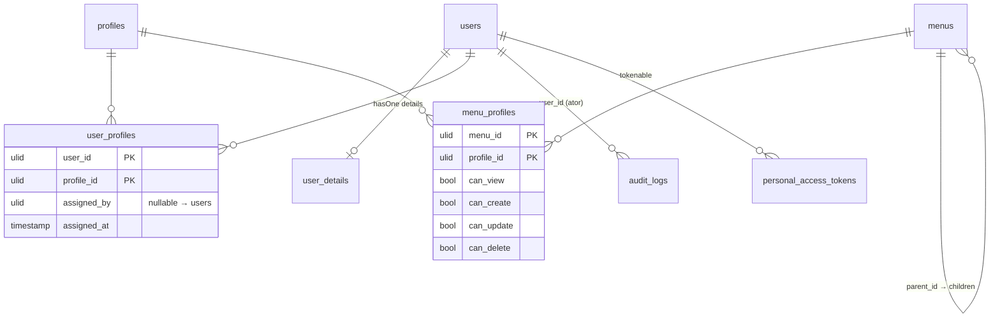

# Módulo IAM

[← Módulos](README.md) · [Autorização](../security/authorization.md) · [Schema](../database/schema.md) · [API v1](../api/v1.md) · [Testes de segurança](../testing/security-tests.md) · [ADRs](../architecture/decisions/README.md)

## Propósito

Responder, para cada requisição: **quem é o ator** (autenticação), **o que
ele pode fazer** (autorização) e **o que ele fez** (auditoria).

## Modelo de domínio

Relações Eloquent reais:

| Model | Relação | Detalhe |
|---|---|---|
| `User` | `profiles(): BelongsToMany<Profile, UserProfile>` | pivot `user_profiles`, `withPivot('assigned_by', 'assigned_at')` |
| `User` | `details(): HasOne<UserDetails>` | dados pessoais/LGPD; não exposto por nenhum Resource |
| `User` | `assignedProfiles(): HasMany<UserProfile>` | atribuições feitas por este usuário |
| `User` | `auditLogs(): HasMany<AuditLog>` | ações das quais ele é o ator |
| `User` | `tokens()` (Sanctum `HasApiTokens`) | `personal_access_tokens` com `ulidMorphs` |
| `Profile` | `users()`, `menus(): BelongsToMany<Menu, MenuProfile>` | a matriz de permissões está no pivot `menu_profiles` |
| `Menu` | `parent()`, `children()` (ordenado por `order`), `profiles()` | scopes `active()` e `roots()` |
| `AuditLog` | `user(): BelongsTo` | sem `updated_at` (`$timestamps = false`) |

## Conceitos

- **Usuário**: identidade autenticável. Usa ULID, soft delete e flag
  `is_active`. Senha com cast `hashed`, oculta por `#[Hidden]`.
- **Perfil (`Profile`)**: agrupamento de permissões. `is_system = true`
  protege o perfil contra edição, exclusão e alteração de permissões pela API.
  Os três perfis semeados (`admin`, `dev`, `viewer`) são de sistema.
- **Menu**: item de navegação hierárquico **e chave de autorização**. O
  `route_name` do menu é o identificador que o middleware `permission`
  consulta ([ADR-0006](../architecture/decisions/ADR-0006-route-permission-matrix.md)).
- **Matriz de permissões**: `menu_profiles`, com 4 flags CRUD por par (menu,
  perfil), todas `false` por padrão.
- **Auditoria**: `audit_logs`, só inserção pela aplicação. Veja
  [audit.md](../security/audit.md).

## Estado semeado (demonstração)

`DatabaseSeeder` → `ProfileSeeder`, `MenuSeeder`, `UserSeeder`:

| Perfil | Usuário demo | Matriz |
|---|---|---|
| `admin` | `admin@napi.dev` | CRUD completo em todos os 5 menus |
| `dev` | `dev@napi.dev` | apenas `can_view` em `users.index` |
| `viewer` | `viewer@napi.dev` | nenhuma linha (negado por padrão) |

Menus: `users.index`, `profiles.index` (filho: `permissions.index`),
`menus.index` e `audit-logs.index`. O menu `audit-logs.index` não tem rota
correspondente na API. As senhas de demonstração estão no seeder e não devem
existir fora de ambiente local.

## Casos de uso

| Caso de uso | Entrada | Autorização | Regra de negócio | Auditoria |
|---|---|---|---|---|
| Login | `LoginRequest` | pública + rate limit | usuário ativo | `UserLoggedIn` → `login` |
| Logout | — | autenticado | revoga **todos** os tokens | inline `logout` |
| CRUD de usuário | `UserStore/UpdateRequest` | matriz `users.index` + `UserPolicy` | não excluir a si mesmo | só a exclusão (inline `user_deleted`) |
| Atribuir perfis | `AssignProfileRequest` → DTO → `AssignProfilesToUser` | matriz `users.index,update` + `assignProfiles` (admin) | não remover o último admin | `ProfileAssigned` → `profile_assigned` |
| CRUD de perfil | `ProfileStore/UpdateRequest` | matriz `profiles.index` + `ProfilePolicy` | perfil de sistema imutável; não excluir com usuários | não |
| Sincronizar permissões | `SyncMenusRequest` → DTO → `SyncMenuPermissions` | matriz `permissions.index,update` + `syncMenus` | perfil de sistema imutável | `PermissionChanged` → `permission_changed` |
| CRUD de menu | `MenuStore/UpdateRequest` | matriz `menus.index` + `MenuPolicy` | não excluir com filhos | não |
| Árvore de menus | — | matriz `menus.index,view` | raízes com `can_view` | não |
| Tokens pessoais | inline no controller | autenticado; escopo no próprio usuário | expiração ≤ 365 dias (limitada a 7 pela config) | não |

## Invariantes do módulo

Estão catalogadas, com local de aplicação e teste, em
[security-policies.md](../security/security-policies.md).

## Limitações conhecidas

- [FIND-004](../findings/README.md#find-004--duas-fontes-de-autorização-que-não-se-conhecem): perfis customizados quase não têm efeito, porque as Policies exigem `admin`/`dev`.
- [FIND-005](../findings/README.md#find-005--menus-são-chaves-de-autorização-sem-proteção-de-sistema): menus-chave podem ser renomeados ou excluídos; o admin não recebe permissão em menus novos.
- [FIND-010](../findings/README.md#find-010--árvore-de-menus-não-filtra-filhos-nem-inativos): a árvore de menus não filtra filhos nem menus inativos.
- `User::hasPermission()` é um stub que retorna `true` ([FIND-007](../findings/README.md#find-007--userhaspermission-é-um-stub-que-sempre-autoriza)).

## Implementação

- Models: `app/Models/{User,Profile,Menu,UserProfile,MenuProfile,AuditLog,UserDetails}.php`
- Policies: `app/Policies/*`
- Actions: `app/Domain/IAM/Actions/*`
- Middleware: `app/Http/Middleware/CheckPermission.php`
- Seeders: `database/seeders/*`
