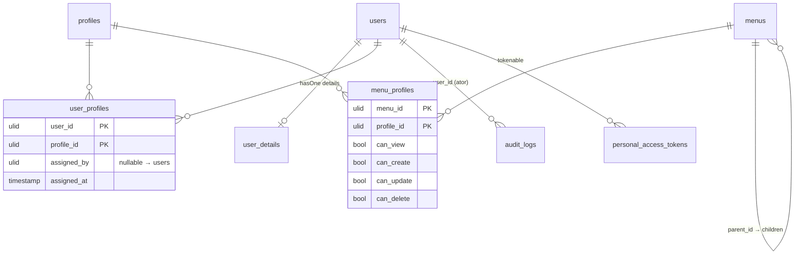

# Módulo IAM

[← Módulos](README.md) · [Autorização](../security/authorization.md) · [Schema](../database/schema.md) · [API v1](../api/v1.md) · [Testes de segurança](../testing/security-tests.md) · [ADRs](../architecture/decisions/README.md)

## Propósito

Responder, para cada requisição: **quem é o ator** (autenticação), **o que
ele pode fazer** (autorização) e **o que ele fez** (auditoria).

## Modelo de domínio

Relações Eloquent reais:

| Model | Relação | Detalhe |
|---|---|---|
| `User` | `profiles(): BelongsToMany<Profile, UserProfile>` | pivot `user_profiles`, `withPivot('assigned_by', 'assigned_at')` |
| `User` | `details(): HasOne<UserDetails>` | dados pessoais/LGPD; não exposto por nenhum Resource |
| `User` | `assignedProfiles(): HasMany<UserProfile>` | atribuições feitas por este usuário |
| `User` | `auditLogs(): HasMany<AuditLog>` | ações das quais ele é o ator |
| `User` | `tokens()` (Sanctum `HasApiTokens`) | `personal_access_tokens` com `ulidMorphs` |
| `Profile` | `users()`, `menus(): BelongsToMany<Menu, MenuProfile>` | a matriz de permissões está no pivot `menu_profiles` |
| `Menu` | `parent()`, `children()` (ordenado por `order`), `profiles()` | scopes `active()` e `roots()` |
| `AuditLog` | `user(): BelongsTo` | sem `updated_at` (`$timestamps = false`) |

## Conceitos

- **Usuário**: identidade autenticável. Usa ULID, soft delete e flag
  `is_active`. Senha com cast `hashed`, oculta por `#[Hidden]`.
- **Perfil (`Profile`)**: agrupamento de permissões. `is_system = true`
  protege o perfil contra edição, exclusão e alteração de permissões pela API.
  Os três perfis semeados (`admin`, `dev`, `viewer`) são de sistema.
- **Menu**: item de navegação hierárquico que também define uma **área de
  permissão**. A `key` do menu (imutável, única) é o identificador de
  permissão; `route_name`, `label` e `is_active` são só navegação. Menus
  `is_system` (as áreas usadas pelas rotas) não podem ser excluídos
  ([ADR-0008](../architecture/decisions/ADR-0008-layered-authorization-model.md)).
- **Matriz de permissões**: `menu_profiles`, com 4 flags CRUD por par (menu,
  perfil), todas `false` por padrão. Uma permissão é `{key}.{ação}`, por
  exemplo `users.update`, e `User::hasPermission()` é a única resposta
  funcional do sistema.
- **Administrador**: o perfil de sistema `admin` detém todas as permissões
  funcionais. O sistema mantém pelo menos um administrador **ativo**
  (INV-08).
- **Auditoria**: `audit_logs`, só inserção pela aplicação. Veja
  [audit.md](../security/audit.md).

## Estado semeado (demonstração)

`DatabaseSeeder` → `ProfileSeeder`, `MenuSeeder`, `UserSeeder`:

| Perfil | Usuário demo | Permissões funcionais |
|---|---|---|
| `admin` | `admin@napi.dev` | todas (implícito; sem linhas na matriz) |
| `dev` | `dev@napi.dev` | nenhuma: autoatendimento por `/auth/me` e `/tokens` |
| `viewer` | `viewer@napi.dev` | nenhuma (negado por padrão) |

Menus de sistema (`key`): `users`, `profiles` (filho: `permissions`),
`menus` e `audit-logs`. O menu `audit-logs` não tem rota correspondente na
API.

> Fase 3.2: o seed deixou de gravar linhas de matriz para `admin`
> (redundantes com a permissão implícita) e a linha `users.view` do `dev`
> ([FIND-009](../findings/README.md#find-009--perfil-dev-lista-todos-os-usuários-mas-não-pode-ver-nenhum)). As senhas de demonstração estão no seeder e não devem
existir fora de ambiente local.

## Casos de uso

| Caso de uso | Entrada | Autorização | Regra de negócio | Auditoria |
|---|---|---|---|---|
| Login | `LoginRequest` | pública + rate limit | usuário ativo | `login` |
| Logout | — | autenticado + `write` | revoga **todos** os tokens | `logout` |
| CRUD de usuário | `UserStore/UpdateRequest` → `CreateUserDto`/`UpdateUserDto` → `CreateUser`/`UpdateUser` | `users.{ação}` + `UserPolicy` | só nome, e-mail e senha (criação); ninguém exclui a si mesmo; só admin altera ou exclui administrador; exclusão via `DeleteUser` protege o último admin ativo | `user_created`, `user_updated`, `user_deleted` |
| Desativar usuário | — → `DeactivateUser` | `users.update` + `UserPolicy::deactivate` | ninguém desativa a si mesmo; só admin desativa administrador; último admin ativo (409); revoga tokens e remove sessões web | `user_deactivated` |
| Reativar usuário | — → `ActivateUser` | `users.update` + `UserPolicy::activate` | só admin reativa administrador; não devolve tokens nem sessões | `user_activated` |
| Atribuir perfis | `AssignProfileRequest` → DTO → `AssignProfilesToUser` | `users.update` + `assignProfiles` (anti-escalação) | último admin ativo (409), em transação com lock | `profile_assigned` |
| CRUD de perfil | `ProfileStore/UpdateRequest` | `profiles.{ação}` + `ProfilePolicy` | perfil de sistema imutável; não excluir com usuários | não (adiado) |
| Sincronizar permissões | `SyncMenusRequest` → DTO → `SyncMenuPermissions` | `permissions.update` + `syncMenus` (anti-escalação) | perfil de sistema imutável; delegado não edita o próprio perfil nem concede o que não tem | `permission_changed` |
| CRUD de menu | `MenuStore/UpdateRequest` | `menus.{ação}` + `MenuPolicy` | `key` imutável; menu de sistema ou com filhos não é excluído | não (adiado) |
| Árvore de menus | — | autenticado + `read` | menus ativos com `{key}.view`, filhos só sob pai visível | não |
| Tokens pessoais | `TokenStoreRequest` | autenticado; escopo no próprio usuário | abilities ⊆ as do token atual; expiração ≤ 7 dias | `token_created`, `token_revoked` |

## Invariantes do módulo

Estão catalogadas, com local de aplicação e teste, em
[security-policies.md](../security/security-policies.md).

## Limitações conhecidas

- CRUD de perfis e menus não é auditado (adiado, veja [audit.md](../security/audit.md#cobertura)).
- Um menu pode ser pai de si mesmo ([FIND-019](../findings/README.md#find-019--menu-pode-ser-pai-de-si-mesmo)). A árvore ignora ciclos, mas o dado inválido é aceito.

Desde a [Fase 4.2](../phases/phase-04-2-user-management.md) os casos de uso
de usuário servem dois adapters, a API (`Api\V1`) e a área administrativa
(`Web\Admin`), com as mesmas Policies, Actions e eventos.

As limitações estruturais registradas na Fase 3.1 (FIND-004, FIND-005,
FIND-007, FIND-010) foram resolvidas na Fase 3.2; veja
[findings](../findings/README.md).

## Implementação

- Models: `app/Models/{User,Profile,Menu,UserProfile,MenuProfile,AuditLog,UserDetails}.php`
- Policies: `app/Policies/*`
- Actions: `app/Domain/IAM/Actions/*`
- Invariante e contexto: `app/Domain/IAM/{EnsureActiveAdministratorRemains,AuditContext}.php`
- Middleware: `app/Http/Middleware/{CheckPermission,EnsureTokenAbility,EnsureUserIsActive,EnsureUserCanAccessAdmin}.php`
- Adapters: `app/Http/Controllers/Api/V1/*` (JSON) e `app/Http/Controllers/Web/Admin/*` (Blade); seções da área administrativa em `app/Http/Admin/AdminNavigation.php`
- Eventos e auditoria: `app/Events/*`, `app/Listeners/RecordAuditLog.php`
- Seeders: `database/seeders/*`
