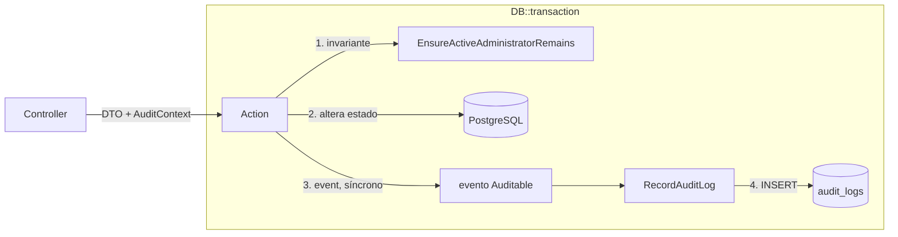

# Auditoria

[← Segurança](README.md) · [ADR-0005](../architecture/decisions/ADR-0005-event-driven-audit.md) · [Schema](../database/schema.md#audit_logs)

## Tabela `audit_logs`

| Coluna | Tipo | Conteúdo |
|---|---|---|
| `id` | ULID PK | — |
| `user_id` | ULID, FK `users` `set null` | **ator** da ação (`null` para operações de sistema) |
| `action` | `varchar(50)` | identificador da ação |
| `subject_type` / `subject_id` | `varchar(100)` / ULID | entidade afetada (FQCN; índice composto) |
| `ip` | `inet` (`ipAddress`) | IP de origem |
| `user_agent` | `text` | User-Agent |
| `meta` | `jsonb` | dados específicos da ação |
| `created_at` | `timestamp`, `useCurrent()` | preenchido pelo **banco**; não há `updated_at` (`$timestamps = false`) |

Índices: `(user_id, created_at)` para a trilha de um ator e
`(subject_type, subject_id)` para o histórico de uma entidade.

## Ações auditadas

Todas nascem de um evento de domínio que implementa
`App\Events\Contracts\Auditable`, e um único listener, `RecordAuditLog`,
grava **uma** linha por evento. Ator, IP e User-Agent vêm do `AuditContext`
carregado pelo evento.

| `action` | Evento | Disparado em | Subject | `meta` |
|---|---|---|---|---|
| `login` | `UserLoggedIn` | `AuthController::login`, `Web\Admin\Auth\LoginController::store` | — | — |
| `logout` | `UserLoggedOut` | `AuthController::logout`, `Web\Admin\Auth\LoginController::destroy` | — | `revoked_tokens` (0 no logout web) |
| `user_created` | `UserCreated` | `CreateUser` (API e admin) | `App\Models\User` | — |
| `user_updated` | `UserUpdated` | `UpdateUser` (API e admin; só se algo mudou) | `App\Models\User` | `fields`: nomes dos campos alterados, **sem valores** |
| `user_deactivated` | `UserDeactivated` | `DeactivateUser` (API e admin) | `App\Models\User` | `revoked_tokens`, `ended_sessions` |
| `user_activated` | `UserActivated` | `ActivateUser` (API e admin) | `App\Models\User` | — |
| `user_deleted` | `UserDeleted` | `DeleteUser` | `App\Models\User` | — |
| `profile_assigned` | `ProfileAssigned` | `AssignProfilesToUser` | `App\Models\User` | `profile_ids` (conjunto final) |
| `permission_changed` | `PermissionChanged` | `SyncMenuPermissions` | `App\Models\Profile` | `permissions` (matriz final completa) |
| `token_created` | `TokenCreated` | `TokenController::store` | `App\Models\User` (dono) | `token_id`, `name`, `abilities`, `expires_at` |
| `token_revoked` | `TokenRevoked` | `TokenController::destroy` | `App\Models\User` (dono) | `token_id`, `name` |
| `security_test_executed` | `SecurityTestExecuted` | `RunIdorTest` (Fase 5.1) | `App\Models\SecurityTestRun` | `test_key`, `scenario`, `acting_as_user_id`, `verdict` |

O id do token vai em `meta` porque é inteiro e `subject_id` é ULID. O segredo
do token nunca é gravado.

`security_test_executed` registra que um operator executou um teste do
[Security Lab](../modules/security.md#audit_logs--security_test_runs). O ator
é o operator real, nunca o actor simulado, e o `subject` aponta para a linha
de `security_test_runs`, que guarda o que o teste observou. O log de
auditoria não repete esse contexto nem o conteúdo exibido.

## Cobertura

Classificação feita na Fase 3.2 ([FIND-012](../findings/README.md#find-012--lacunas-de-cobertura-da-auditoria)):

| Ação | Decisão | Justificativa |
|---|---|---|
| Login bem-sucedido | já auditado | — |
| Logout | já auditado (migrado para evento) | encerramento de sessões |
| Atribuição de perfil | já auditado | mudança de privilégio |
| Mudança de permissão | já auditado | mudança de privilégio |
| Usuário criado / atualizado / excluído | **audit now** | mudança de identidade; o e-mail é credencial de login |
| Usuário ativado / desativado | **audit now** (Fase 4.2) | concede ou retira a capacidade de autenticar |
| Teste do Security Lab executado | **audit now** (Fase 5.1) | execução de código deliberadamente vulnerável precisa de um responsável |
| Token criado / revogado | **audit now** | criação e destruição de credencial |
| Login falho | **defer** (Fase 5) | exige decidir como guardar o e-mail tentado (dado pessoal, possivelmente de terceiros) e se relaciona com a revisão do rate limit ([FIND-016](../findings/README.md#find-016--rate-limiting-restrito-ao-login-e-por-emailip), [FIND-018](../findings/README.md#find-018--sinais-de-enumeração-no-login)) |
| CRUD de perfil | **defer** (Fase 5, com o ADR do conjunto mínimo auditável) | criar ou excluir perfil não concede nada sozinho; o que concede é a matriz e a atribuição, que já são auditadas |
| CRUD de menu | **defer** (Fase 5) | desde a Fase 3.2 o menu é navegação: `key` é imutável e menus de sistema não são excluídos, então editar menu não altera autorização |
| Acessos negados (401/403/404) | **not needed** na aplicação | volume alto e baixo valor por linha; é papel de logs de acesso e observabilidade |

## Desenho: domínio → evento → listener → log

**Por que eventos.** A Action publica o fato ("perfis atribuídos") sem
conhecer quem reage. Isso reduz o acoplamento (a Action não importa
`AuditLog`), permite reações novas como listeners (notificação, cache) e
deixa a regra de negócio intocada quando o formato da auditoria muda.

**Decisões da Fase 3.2:**

| Decisão | Efeito |
|---|---|
| Um único registro de listener (discovery), sem `Event::listen()` manual | 1 evento = 1 linha ([FIND-002](../findings/README.md#find-002--listeners-de-auditoria-registrados-em-duplicidade)) |
| Evento carrega `AuditContext` (ator, IP, UA) | listeners não usam `auth()` nem `request()`; funcionam fora de HTTP ([FIND-013](../findings/README.md#find-013--contexto-de-auditoria-acoplado-ao-processo-http-e-sem-atomicidade)) |
| Evento disparado dentro da transação, listener síncrono | estado e trilha são atômicos: uma operação rejeitada (ex.: 409 do último admin) não deixa linha, e uma falha ao gravar a trilha desfaz a operação |
| Contrato `Auditable` com `auditEntry()` | cada evento descreve o próprio registro; `subject_type` padronizado em FQCN |

**Limitações que continuam:**

| Limitação | Consequência |
|---|---|
| Listener síncrono | Enfileirar a auditoria exigiria `ShouldDispatchAfterCommit` e perderia a atomicidade descrita acima |
| IP depende do proxy | Não há `trustProxies`; atrás de um balanceador seria gravado o IP dele. Configurar no deploy |
| `meta` guarda só o estado final | Não se sabe o que foi **removido**, só o conjunto resultante |

## Proteção dos próprios logs

- Não há endpoint que leia, altere ou apague `audit_logs`. O menu
  `audit-logs` existe no seeder sem rota correspondente.
- A exclusão do ator não apaga logs (INV-14).
- **Não há proteção contra alteração**: o model permite `update()`/`delete()`,
  e o banco não tem trigger nem restrição de privilégio
  ([FIND-014](../findings/README.md#find-014--audit_logs-é-mutável), adiado para a Fase 5).

## Dados sensíveis

- Nenhuma senha, token ou hash é gravado em `meta`. `user_updated` registra
  só os nomes dos campos alterados.
- IP e User-Agent são dados pessoais sob a LGPD. Não há política de retenção
  nem expurgo definida.

## Testes

Desde a [Fase 4.2](../phases/phase-04-2-user-management.md), cada fato é
auditado num único ponto, a Action, e por isso a API e a área administrativa
produzem a mesma linha. `tests/Feature/Admin/UserManagementTest.php` verifica
ator, subject e `meta` das operações feitas pela área administrativa, e que a
senha não aparece na trilha.

`tests/Feature/Security/AuditIntegrityTest.php` usa tokens reais e verifica
**cardinalidade** (`count() === 1`) para cada ação, o ator gravado, o
`assigned_by` do pivot, os campos de `meta` e que o contexto vem do evento, e
não da sessão. `AdminInvariantTest › leaves no audit trail for a rejected change`
prova a atomicidade. Os testes antigos de `AuditEventTest` (`exists()`) foram
mantidos.
