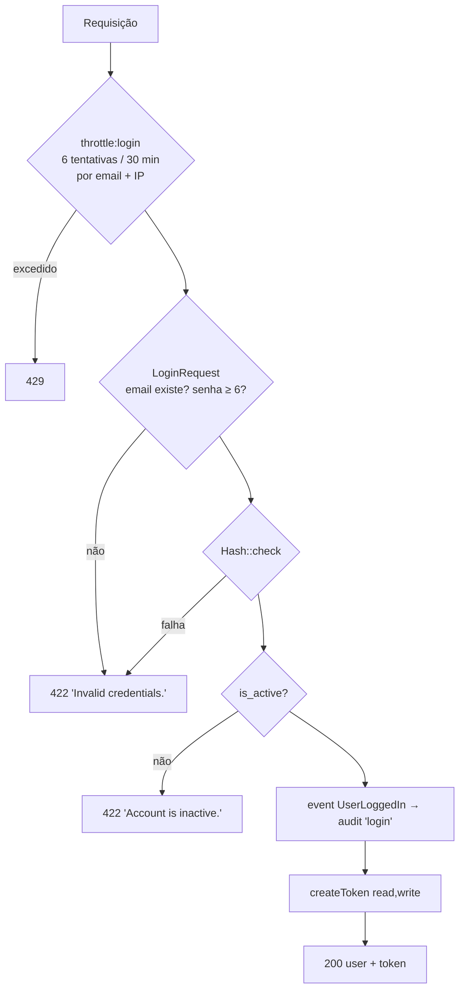

# Autenticação

[← Segurança](README.md) · [ADR-0003](../architecture/decisions/ADR-0003-sanctum.md) · [API v1](../api/v1.md#autenticação)

## Mecanismo

Laravel Sanctum com **personal access tokens** enviados como
`Authorization: Bearer napi_...`. O token em texto claro é devolvido **uma
única vez**, na criação. No banco fica apenas o hash SHA-256
(`personal_access_tokens.token`, único).

A autenticação SPA por cookie **não está ativa**: `bootstrap/app.php` não
chama `statefulApi()`, e o grupo `api` contém apenas `SubstituteBindings`.
`SANCTUM_STATEFUL_DOMAINS` e `guard => ['web']` estão configurados, mas não
são exercidos pelas rotas da API.

## Login: `POST /api/v1/auth/login`

| Controle | Implementação | Teste |
|---|---|---|
| Hash de senha | cast `password => hashed` em `User`; bcrypt (`BCRYPT_ROUNDS=12` no `.env.example`) | indireto (login) |
| Mensagem uniforme para e-mail e senha errados | `LoginRequest::messages()` e `ValidationException` com `'Invalid credentials.'` | `rejects invalid password` |
| Rate limit | `RateLimiter::for('login')` em `AppServiceProvider`: `Limit::perMinutes(30, 6)` por `email + IP` | `rate limits login after 6 attempts in 30 minutes` |
| Bloqueio de conta inativa | `AuthController::login` | **sem teste** |
| Auditoria de login | `UserLoggedIn` → `AuditUserLogin` | indireto |
| Tentativas falhas auditadas | **não existe** | — |

## Tokens

| Aspecto | Comportamento real |
|---|---|
| Emissão no login | nome `api-token`, abilities `['read', 'write']`, sem `expires_at` |
| Emissão manual (`POST /tokens`) | abilities `read`/`write`/`delete`, `expires_in_days` entre 1 e 365 (padrão 7) |
| Expiração global | 7 dias a partir de `created_at` (`config/sanctum.php`). **Prevalece sobre `expires_at` maior**: um token de 30 dias morre no 7º dia |
| Abilities | gravadas, **nunca verificadas** ([FIND-001](../findings/README.md#find-001--abilities-de-token-não-são-aplicadas)) |
| Revogação individual | `DELETE /tokens/{id}`, filtrado por `$request->user()->tokens()`; não é possível revogar token alheio. Responde 200 mesmo que nada seja apagado |
| Logout | apaga **todos** os tokens do usuário (logout global) |
| Limpeza de expirados | não agendada |
| Prefixo | `napi_`, detectável por secret scanning |

## Estado da conta

- **Soft delete**: o Sanctum resolve o `tokenable` com o escopo do
  `SoftDeletes`, então tokens de usuário excluído deixam de autenticar. As
  linhas de token permanecem no banco.
- **`is_active = false`**: impede **novos** logins, mas tokens já emitidos
  continuam válidos, confirmado em execução na Fase 3.1
  ([FIND-003](../findings/README.md#find-003--usuário-desativado-continua-autenticado)).
  Também não há endpoint que altere `is_active`: `UserUpdateRequest` não
  aceita o campo.

## Rotas que exigem autenticação

Todas as rotas `/api/v1/*` exceto `POST /auth/login`. Sem token válido, a
resposta é 401 (`returns 401 when accessing protected route without token`).

## Riscos residuais

Veja a seção Authentication do [threat model](threat-model.md#autenticação).
