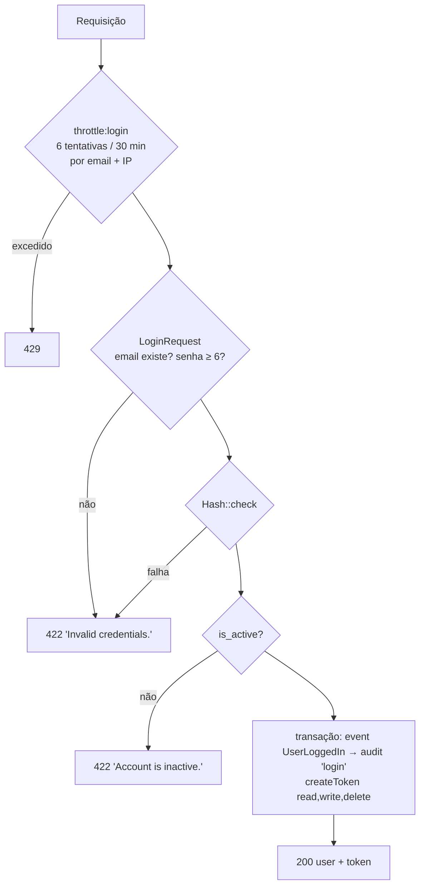

# Autenticação

[← Segurança](README.md) · [ADR-0003](../architecture/decisions/ADR-0003-sanctum.md) · [ADR-0008](../architecture/decisions/ADR-0008-layered-authorization-model.md) · [API v1](../api/v1.md#autenticação)

## Mecanismo

Laravel Sanctum com **personal access tokens** enviados como
`Authorization: Bearer napi_...`. O token em texto claro é devolvido **uma
única vez**, na criação. No banco fica apenas o hash SHA-256
(`personal_access_tokens.token`, único).

A autenticação SPA por cookie **não está ativa**: `bootstrap/app.php` não
chama `statefulApi()`, e o grupo `api` contém apenas `SubstituteBindings`.
`SANCTUM_STATEFUL_DOMAINS` e `guard => ['web']` estão configurados, mas não
são exercidos pelas rotas da API. A sessão `web` é usada apenas pela
[área administrativa](#área-administrativa-sessão-web).

## Login: `POST /api/v1/auth/login`

| Controle | Implementação | Teste |
|---|---|---|
| Hash de senha | cast `password => hashed` em `User`; bcrypt (`BCRYPT_ROUNDS=12` no `.env.example`) | indireto (login) |
| Mensagem uniforme para e-mail e senha errados | `LoginRequest::messages()` e `ValidationException` com `'Invalid credentials.'` | `rejects invalid password` |
| Rate limit | `RateLimiter::for('login')` em `AppServiceProvider`: `Limit::perMinutes(30, 6)` por `email + IP` | `rate limits login after 6 attempts in 30 minutes` |
| Bloqueio de conta inativa | `AuthController::login` | `does not issue a token to an inactive user` |
| Auditoria de login | `UserLoggedIn` → `RecordAuditLog`, **uma** linha | `records a login exactly once` |
| Tentativas falhas auditadas | **não existe** (adiado, veja [audit.md](audit.md#cobertura)) | — |

## Tokens

| Aspecto | Comportamento |
|---|---|
| Emissão no login | nome `api-token`, abilities `['read', 'write', 'delete']`. O limite real é o IAM do dono |
| Emissão manual (`POST /tokens`) | abilities `read`/`write`/`delete`, **subconjunto** das abilities do token que faz a chamada (senão 403). `expires_in_days` entre 1 e o teto global (7), padrão 7 |
| Expiração global | 7 dias a partir de `created_at` (`config/sanctum.php`). `expires_in_days` não aceita valores acima disso ([FIND-015](../findings/README.md#find-015--expiração-de-token-aceita-valores-que-nunca-terão-efeito)) |
| Abilities | **aplicadas** pelo método HTTP (`EnsureTokenAbility`): GET→`read`, POST/PUT/PATCH→`write`, DELETE→`delete`. Ausência → 403 |
| Revogação individual | `DELETE /tokens/{id}`, só entre os tokens do próprio usuário. Token inexistente ou alheio → 404 |
| Logout | apaga **todos** os tokens do usuário (logout global) e audita `logout` com a quantidade revogada |
| Auditoria | `token_created` e `token_revoked` com id, nome e abilities (nunca o segredo) |
| Limpeza de expirados | não agendada |
| Prefixo | `napi_`, detectável por secret scanning |

## Estado da conta

A regra é única: **só um usuário ativo e não excluído autentica.** Ela é
aplicada num único ponto, o callback
`Sanctum::authenticateAccessTokensUsing` no `AppServiceProvider`, que
invalida o token quando o dono não está ativo ([FIND-003](../findings/README.md#find-003--usuário-desativado-continua-autenticado)).

| Situação | Resultado | Teste |
|---|---|---|
| `is_active = false` com token emitido antes | 401 em qualquer rota autenticada | `rejects a valid token once its owner is deactivated` |
| Soft delete | 401 (o `tokenable` some pelo escopo do `SoftDeletes`) | `rejects the token of a soft-deleted user` |
| Nova tentativa de login inativo | 422, sem token | `does not issue a token to an inactive user` |

Há duas proteções distintas:

- **Enforcement**, na autenticação, que não depende de nada ter sido
  revogado. O teste desativa o usuário com um `UPDATE` direto, sem eventos
  de model, e o token é recusado mesmo assim.
- **Higiene**, um hook `updated` em `User` que apaga os tokens quando
  `is_active` passa de `true` para `false`.

Não há endpoint que altere `is_active`. Ele fica para a Fase 4, e o hook de
higiene já cobre qualquer caminho futuro que use o model.

## Rotas que exigem autenticação

Todas as rotas `/api/v1/*` exceto `POST /auth/login`. Sem token válido, a
resposta é 401. Com token válido, toda rota autenticada também passa pela
checagem de ability ([autorização](authorization.md#camada-2-abilities-do-token)).

## Área administrativa: sessão web

Desde a [Fase 4.1](../phases/phase-04-1-admin-shell.md), `/admin` usa o
guard `web` (sessão), independente dos tokens: o login web não emite token e
o logout web não revoga nenhum. `POST /admin/login` responde
`Credenciais inválidas.` para e-mail inexistente, senha errada e conta
inativa, regenera a sessão e audita via `UserLoggedIn`; o logout invalida a
sessão e rotaciona o token CSRF. `EnsureUserIsActive` (grupo `web`) encerra
a sessão de quem for desativado depois do login. Rate limit: 5 tentativas
por `email + IP`.

## Riscos residuais

Veja a seção Authentication do [threat model](threat-model.md#autenticação).
