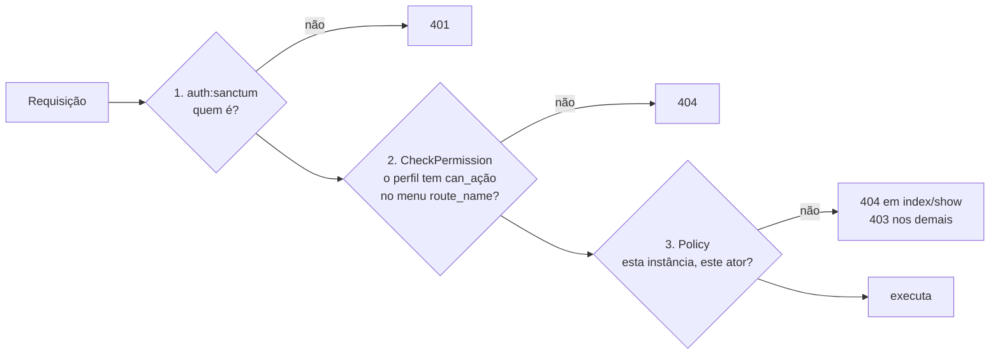

# Autorização

[← Segurança](README.md) · [ADR-0004](../architecture/decisions/ADR-0004-policy-based-authorization.md) · [ADR-0006](../architecture/decisions/ADR-0006-route-permission-matrix.md) · [IAM](../modules/iam.md)

## Três portões, uma interseção

Um endpoint de IAM só executa se **os três** permitirem:



| Portão | Pergunta | Fonte de verdade | Granularidade |
|---|---|---|---|
| 1. Sanctum | O token é válido? | `personal_access_tokens` | ator |
| 2. Matriz | Algum perfil do ator tem `can_{ação}` neste `route_name`? | **dados**: `menu_profiles` | rota × ação CRUD |
| 3. Policy | Esta regra de instância permite? | **código**: `app/Policies/*`, por slug de perfil | instância |

**Não existe uma fonte única de verdade para autorização.** A matriz e as
Policies são independentes e o acesso efetivo é a interseção entre elas:

| Ator | Matriz permite | Policy permite | Efetivo |
|---|---|---|---|
| `admin` | tudo | tudo, exceto regras de instância | tudo, exceto regras de instância |
| `dev` | só `users.index,view` | `viewAny` de User/Profile/Menu; `view` de si mesmo | listar usuários e ver a si mesmo |
| `viewer` | nada | quase nada | nada (404) |
| perfil customizado com CRUD completo em `profiles.index` | tudo em perfis | nada (exige `admin` ou `dev`) | **nada**, confirmado em execução |

A última linha é o [FIND-004](../findings/README.md#find-004--duas-fontes-de-autorização-que-não-se-conhecem):
com as Policies atuais, a matriz só consegue **restringir** `admin` e `dev`;
não consegue **conceder** acesso a perfis novos.

## Portão 2: a matriz

`app/Http/Middleware/CheckPermission.php`:

```php
$user->profiles()
    ->whereHas('menus', fn ($q) => $q->where('route_name', $routeName)
        ->where("menu_profiles.can_{$action}", true))
    ->exists();
```

- A coluna do pivot é qualificada (`menu_profiles.can_*`). O comentário no
  arquivo explica que `wherePivot()` dentro de `whereHas()` gera SQL errado.
- `$action` vem da declaração da rota (`permission:users.index,update`), não
  do cliente. Não há interpolação de entrada do usuário no nome da coluna.
- Mapeamento rota → chave:

| Rotas | Chave da matriz |
|---|---|
| `users.*`, `users.profiles.update` | `users.index` |
| `profiles.*` | `profiles.index` |
| `profiles.menus.update` | `permissions.index` (update) |
| `menus.*`, `menus.tree` | `menus.index` |
| `auth.*`, `tokens.*` | nenhuma (só autenticação) |

## Portão 3: as Policies

| Policy | Regra | Relevância de segurança |
|---|---|---|
| `UserPolicy::viewAny` | `admin` ou `dev` | `dev` lista todos ([FIND-009](../findings/README.md#find-009--perfil-dev-lista-todos-os-usuários-mas-não-pode-ver-nenhum)) |
| `UserPolicy::view` | a si mesmo ou `admin` | protege contra IDOR em `GET /users/{id}` |
| `UserPolicy::update` | `admin` em outro usuário, ou a si mesmo | a auto-edição é barrada antes pela matriz para não-admins |
| `UserPolicy::delete` | `admin`, nunca a si mesmo | evita auto-exclusão |
| `UserPolicy::assignProfiles` | `admin` | só admin concede privilégio |
| `ProfilePolicy::update/delete/syncMenus` | `admin` e perfil não `is_system`; `delete` também sem usuários | perfis de sistema imutáveis |
| `MenuPolicy::delete` | `admin` e sem filhos | integridade da árvore |
| `MenuPolicy::update` | `admin` | **não há proteção de menus-chave** ([FIND-005](../findings/README.md#find-005--menus-são-chaves-de-autorização-sem-proteção-de-sistema)) |

`hasProfile()` lê a relação `profiles` já carregada no model, com uma
consulta por requisição.

## Visibilidade de menu ≠ autorização

No NAPI a tabela `menu_profiles` tem **dois papéis**, e eles precisam
continuar distintos:

1. **Autorização (portão 2)**: aplicada no backend, em toda requisição, pelo
   middleware. É o que protege a API.
2. **Visibilidade**: `GET /menus/tree` devolve os menus raiz com `can_view`
   para os perfis do ator, para uma interface decidir o que mostrar.

Esconder um item de menu **não é** controle de segurança. Um cliente pode
chamar qualquer rota diretamente, e a proteção continua sendo o middleware e
a Policy. Hoje a árvore mostra **mais** do que o usuário pode acessar: os
filhos não são filtrados por `can_view` ([FIND-010](../findings/README.md#find-010--árvore-de-menus-não-filtra-filhos-nem-inativos)).
Isso não abre acesso, porque a rota filha continua protegida, mas expõe
nomes de rotas.

## Dados do cliente nunca são autorização

- O ator vem sempre de `$request->user()` (token), nunca do corpo.
- `is_system` não é aceito por `ProfileStoreRequest`/`ProfileUpdateRequest`,
  então não pode ser definido pela API.
- `is_active` não é aceito por `UserStoreRequest`/`UserUpdateRequest`.
- Controllers persistem apenas `$request->validated()`.
- `#[Fillable]` limita os atributos gravados em massa, e `shouldBeStrict()`
  lança exceção fora de produção (teste `has fillable protection`).

## Deny by default

Confirmado em três níveis:

- matriz: sem linha, ou flag `false` (default do schema), significa 404;
- Policies: métodos retornam `false` quando nenhuma condição concede;
- Gate: uma ação sem método na Policy é negada.

Exceções: rotas de token e `auth.me`/`auth.logout` exigem apenas
autenticação, e isso é intencional (operam sobre o próprio ator).
