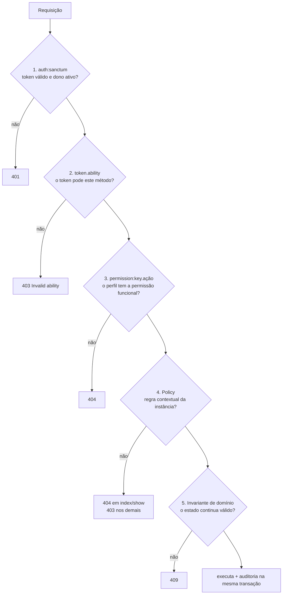

# Autorização

[← Segurança](README.md) · [ADR-0008](../architecture/decisions/ADR-0008-layered-authorization-model.md) · [IAM](../modules/iam.md)

> **Fase 3.2.** O modelo abaixo substitui os "três portões com interseção"
> da Fase 3, em que a matriz e as Policies eram fontes independentes
> ([FIND-004](../findings/README.md#find-004--duas-fontes-de-autorização-que-não-se-conhecem)).
> A decisão está no [ADR-0008](../architecture/decisions/ADR-0008-layered-authorization-model.md),
> que supersede o ADR-0004 e o ADR-0006.

## Camadas, cada uma com uma pergunta



| # | Camada | Pergunta | Fonte | Onde |
|---|---|---|---|---|
| 1 | Autenticação | Quem é, e a conta está ativa? | `personal_access_tokens` + `users.is_active` | `auth:sanctum` + `Sanctum::authenticateAccessTokensUsing` |
| 2 | Capacidade do token | Este token pode fazer este tipo de operação? | abilities do token | `EnsureTokenAbility` (`token.ability`) |
| 3 | Permissão funcional | O perfil pode fazer a ação nesta área? | **dados**: `menu_profiles` × `menus.key` | `User::hasPermission()`, via `CheckPermission` e Policies |
| 4 | Regra contextual | Pode, **neste recurso**? | código | `app/Policies/*` |
| 5 | Invariante de domínio | O sistema continua num estado válido? | código + lock no banco | `EnsureActiveAdministratorRemains` |

Cada camada só **restringe**. Nenhuma concede o que outra negou:

- um token `write` não torna o usuário admin, e um admin com token `read`
  não executa mutação (camadas 2 e 3 são independentes);
- a matriz não substitui a Policy: quem tem `users.delete` ainda não exclui
  a si mesmo nem um administrador (camada 4);
- nem o admin passa pela invariante: o último administrador ativo não perde
  o perfil (camada 5).

## Camada 2: abilities do token

O contrato continua sendo `read`, `write` e `delete`, e o middleware deriva a
ability do método HTTP:

| Método | Ability exigida |
|---|---|
| `GET`, `HEAD`, `OPTIONS` | `read` |
| `POST`, `PUT`, `PATCH` | `write` |
| `DELETE` | `delete` |

O middleware é aplicado ao grupo autenticado inteiro, então uma rota nova
fica coberta por padrão, sem exceções. O login emite `read`, `write` e
`delete`. `POST /tokens` só aceita abilities que o token atual também tem,
o que impede que um token `read` vazado emita para si um token `write`.

Requisições autenticadas por sessão (`actingAs()` nos testes) carregam um
`TransientToken`, que o Sanctum trata como detentor de todas as abilities.
Como `statefulApi()` não está ativo, isso não é alcançável pela API hoje.

## Camada 3: permissões funcionais

Uma permissão é `{menu.key}.{ação}`, com ação em `view`, `create`, `update`
ou `delete` (as colunas `can_*` de `menu_profiles`). `menus.key` é estável:
obrigatória na criação, **proibida** na atualização e distinta do
`route_name` de navegação ([FIND-005](../findings/README.md#find-005--menus-são-chaves-de-autorização-sem-proteção-de-sistema)).

```php
$user->hasPermission('users.update'); // única resposta funcional do sistema
```

- **Admin**: o perfil de sistema `admin` detém todas as permissões
  funcionais, inclusive de chaves criadas depois do seed. A matriz dele não
  é editável (perfil `is_system`), então não há como o admin perder acesso
  por dados.
- **Demais perfis**: a união das flags de todos os perfis do usuário.
- **Fail closed**: formato inválido, ação desconhecida ou chave inexistente
  resultam em `false`.
- `menus.is_active` é estado de navegação e **não** afeta a autorização.
- Os dados são carregados uma vez por instância (`loadMissing('profiles.menus')`).

| Rotas | Permissão |
|---|---|
| `GET /users`, `GET /users/{id}` | `users.view` |
| `POST /users` | `users.create` |
| `PUT /users/{id}`, `PUT /users/{id}/profiles`, `POST /users/{id}/deactivate`, `POST /users/{id}/activate` | `users.update` |
| `DELETE /users/{id}` | `users.delete` |
| `profiles.*` | `profiles.{ação}` |
| `PUT /profiles/{id}/menus` | `permissions.update` |
| `menus.*` | `menus.{ação}` |
| `GET /menus/tree`, `auth.*`, `tokens.*` | nenhuma (só camadas 1 e 2) |
| `/admin/security`, `/admin/security/idor`, `/admin/security/mass-assignment` (só admin, Fases 5.1 e 5.2) | `security-lab.view` |
| `POST /admin/security/idor/run`, `POST /admin/security/mass-assignment/run` (só admin, Fases 5.1 e 5.2) | `security-lab.create` |

Perfis padrão:

| Perfil | Permissões funcionais |
|---|---|
| `admin` | todas (implícito) |
| `dev` | nenhuma: autoatendimento por `/auth/me` e `/tokens` |
| `viewer` | nenhuma |
| customizado | exatamente as flags da matriz |

## Camada 4: regras contextuais nas Policies

As Policies perguntam `hasPermission()` para a parte funcional e acrescentam
apenas o que depende da instância ou do ator:

| Policy | Regra contextual |
|---|---|
| `UserPolicy::view`/`viewAny` | nenhuma: as duas usam `users.view` e nunca divergem ([FIND-009](../findings/README.md#find-009--perfil-dev-lista-todos-os-usuários-mas-não-pode-ver-nenhum)) |
| `UserPolicy::update` | só admin altera conta de administrador |
| `UserPolicy::delete` | nunca a si mesmo; só admin exclui administrador |
| `UserPolicy::deactivate` | nunca a si mesmo; só admin desativa administrador (Fase 4.2) |
| `UserPolicy::activate` | só admin reativa administrador (Fase 4.2) |
| `UserPolicy::assignProfiles` | admin: livre (a invariante protege o último). Os demais não alteram os próprios perfis, não mexem em administrador e não adicionam nem removem perfil com permissão que não têm |
| `ProfilePolicy::update/delete` | perfil `is_system` imutável; `delete` também sem usuários |
| `ProfilePolicy::syncMenus` | perfil `is_system` imutável (inclusive para admin). Os demais não editam a matriz de um perfil que possuem e não concedem flags que não têm |
| `MenuPolicy::delete` | menu `is_system` não é excluído; menu com filhos também não |
| `SecurityTestRunPolicy::viewAny`/`create` | nenhuma: `security-lab.view` e `security-lab.create` (Fase 5.1). Vale para todos os testes do laboratório |
| `SecurityLabResourcePolicy::view` | só o dono do recurso sintético, sem exceção para `admin`. É o controle que o [teste IDOR](idor.md) demonstra, avaliado para o actor com `Gate::forUser()` |

## Anti privilege escalation

| Vetor | Barreira | Teste |
|---|---|---|
| Token `read` executa mutação | camada 2 | `TokenAbilityTest` |
| Token cria token mais poderoso | `TokenStoreRequest::authorize` | `TokenAbilityTest` |
| Usuário se atribui perfil privilegiado | `UserPolicy::assignProfiles` | `PrivilegeEscalationTest` |
| Não-admin concede `admin` ou perfil acima do próprio | `User::holdsPermissionsOf` | `PrivilegeEscalationTest` |
| Não-admin rebaixa ou edita um administrador | `UserPolicy::mayManage` | `PrivilegeEscalationTest` |
| Delegado edita a matriz do próprio perfil | `ProfilePolicy::syncMenus` | `PrivilegeEscalationTest` |
| Delegado concede flag que não tem | `ProfilePolicy::syncMenus` | `PrivilegeEscalationTest` |
| Renomear/excluir menu-chave bloqueia a API | `key` imutável + `is_system` | `AuthorizationMatrixTest` |

## Área administrativa (Blade)

Desde a [Fase 4.2](../phases/phase-04-2-user-management.md), a área
administrativa é um segundo adapter das mesmas camadas. Nada foi duplicado: a
permissão funcional usa o mesmo `CheckPermission`, as autorizações de escrita
usam as mesmas Policies (os FormRequests web estendem os da API) e as regras
de negócio estão nas mesmas Actions.

| # | Camada | API (Bearer) | Admin (sessão `web`) |
|---|---|---|---|
| 1 | Autenticação | token válido + dono ativo → 401 | sessão + `EnsureUserIsActive` → redirect para `/admin` |
| 1b | Entrada na área | — | `admin.access` (`EnsureUserCanAccessAdmin`): ao menos uma seção visível em `AdminNavigation`. Sem isso, o login é recusado e uma sessão existente é encerrada |
| 2 | Capacidade do token | `token.ability` → 403 | não se aplica (sessão não tem abilities); CSRF em toda mutação |
| 3 | Permissão funcional | `permission:` → 404 JSON | o mesmo `permission:` → página 404 |
| 4 | Regra contextual | Policy → 403 | a mesma Policy → 403 |
| 5 | Invariante | `LastActiveAdministratorException` → 409 | a mesma exceção → redirect de volta com mensagem |

**Quem entra.** Não existe flag nem permission key de "admin". Uma seção da
navegação aparece quando a Policy dela permite (`Usuários` ↔
`UserPolicy::viewAny` ↔ `users.view`), e o usuário entra quando ao menos uma
aparece. Por isso o `admin` entra e o `dev` e o `viewer` não, e um perfil
customizado com `users.view` entra. Permissões de áreas que ainda não têm
tela (por exemplo, só `menus.*`) não dão entrada, porque não haveria nada a
usar. Quando novas seções forem criadas, elas passam a contar automaticamente.

**Security Lab (Fase 5.1).** A seção `Segurança` segue a mesma regra
(`SecurityTestRunPolicy::viewAny` ↔ `security-lab.view`) e tem uma camada a
mais, a feature flag: com `SECURITY_LAB_ENABLED=false` a seção não existe, as
rotas respondem 404 (middleware `security.lab`) e a permissão do laboratório
não conta como acesso ao admin. Executar um teste usa a ação `create` da
matriz. Veja [security.md](../modules/security.md#fronteiras).

**Objeto × propriedade (Fase 5.2).** Uma Policy responde se o ator pode
agir sobre **este objeto**. Ela não responde quais **propriedades** uma
operação pode alterar: isso é o contrato de entrada da operação
(`validated()`, DTO), descrito em [mass-assignment.md](mass-assignment.md) e
garantido no IAM pela [INV-11](security-policies.md#inv-11--entrada-do-cliente-não-define-atributos-de-autorização).
A Policy do laboratório (`SecurityTestRunPolicy`) continua decidindo só quem
opera o laboratório.

**Esconder link não é autorizar.** A navegação e os botões usam `@can` com as
mesmas abilities, mas cada rota mantém `permission:` e Policy próprios.
`RouteCoverageTest` impõe isso a todas as rotas `admin/*`.

## Visibilidade de menu ≠ autorização

`GET /menus/tree` devolve os menus **ativos** em que o ator tem
`{key}.view`, em qualquer profundidade. Um filho só aparece se o pai
aparecer. A árvore é uma **projeção** da camada 3: a interface pode esconder
itens a partir dela, mas quem protege a API continuam sendo as camadas 1 a 5.
Por isso a árvore é acessível a qualquer usuário autenticado: ela só revela
o que o próprio ator já pode ver. Um teste garante que aparecer na árvore
não concede acesso (`MenuTreeTest`).

## Dados do cliente nunca são autorização

- O ator vem sempre do token, nunca do corpo.
- `is_system` não é aceito em perfis nem em menus, e `Menu` não o tem em `#[Fillable]`.
- `key` de menu é `prohibited` na atualização.
- `is_active` não é aceito por `UserStoreRequest`/`UserUpdateRequest`.
- Controllers persistem apenas `$request->validated()`.
- As Policies que recebem o conjunto pedido (`assignProfiles`, `syncMenus`)
  avaliam a entrada ainda não validada de forma conservadora: na dúvida,
  negam.

## Deny by default

- camada 1: sem token, token expirado ou dono inativo → 401;
- camada 2: ability ausente → 403;
- camada 3: sem linha na matriz, flag `false` ou chave desconhecida → 404;
- camada 4: métodos retornam `false` se nenhuma condição concede;
- Gate: uma ação sem método na Policy é negada.

## Códigos de resposta

A convenção do ADR-0006 foi mantida: negação funcional é **404**, para não
revelar a área. Regras contextuais em escrita respondem **403**, porque o
ator já sabe que a área existe. Ability ausente é **403**, e o dono do token
conhece as rotas. Violação de invariante é **409**. Uma padronização completa
fica para o [FIND-020](../findings/README.md#find-020--respostas-de-autorização-e-de-tokens-inconsistentes).
